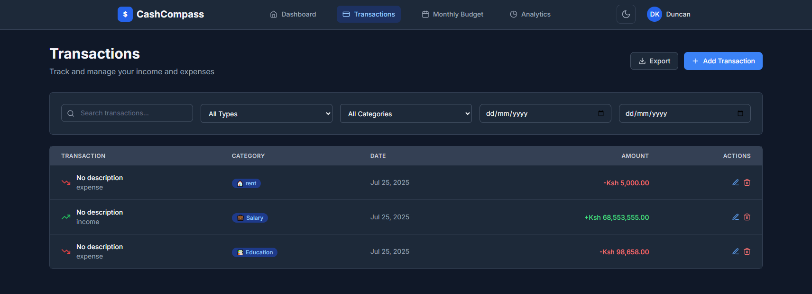
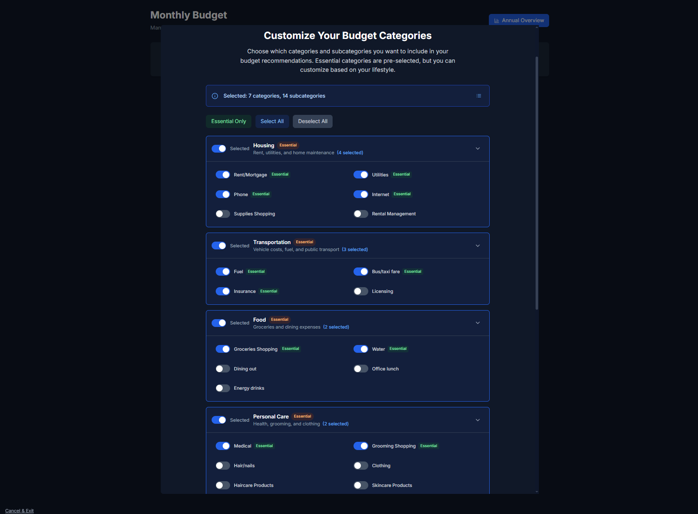
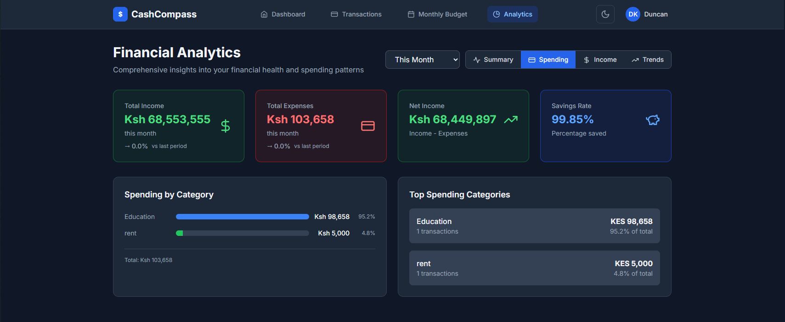
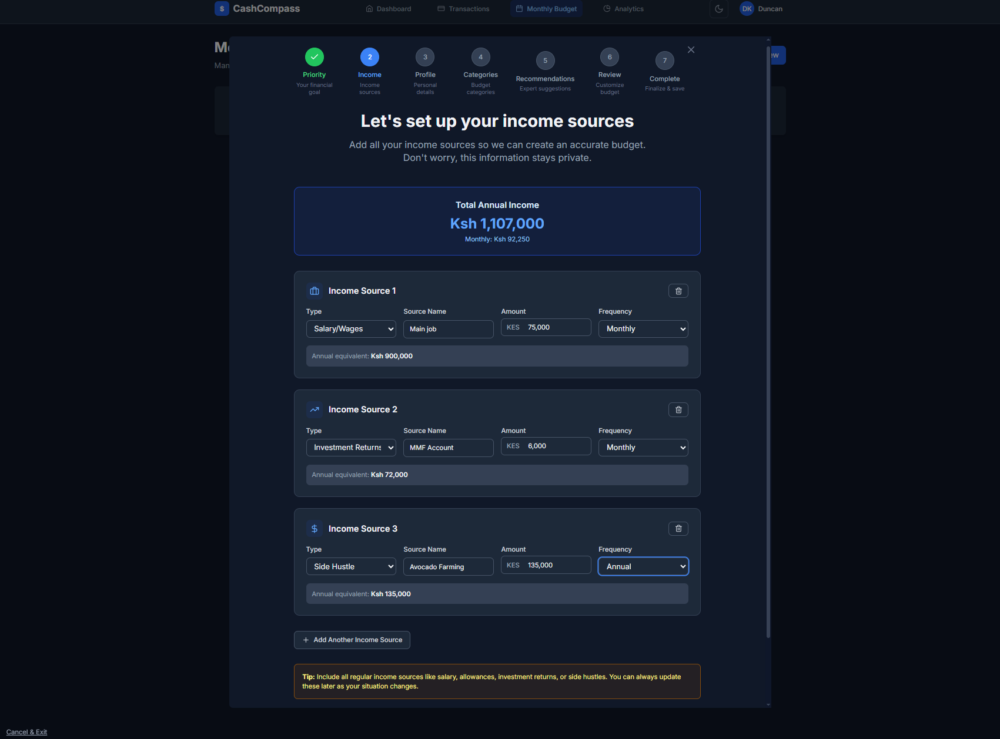
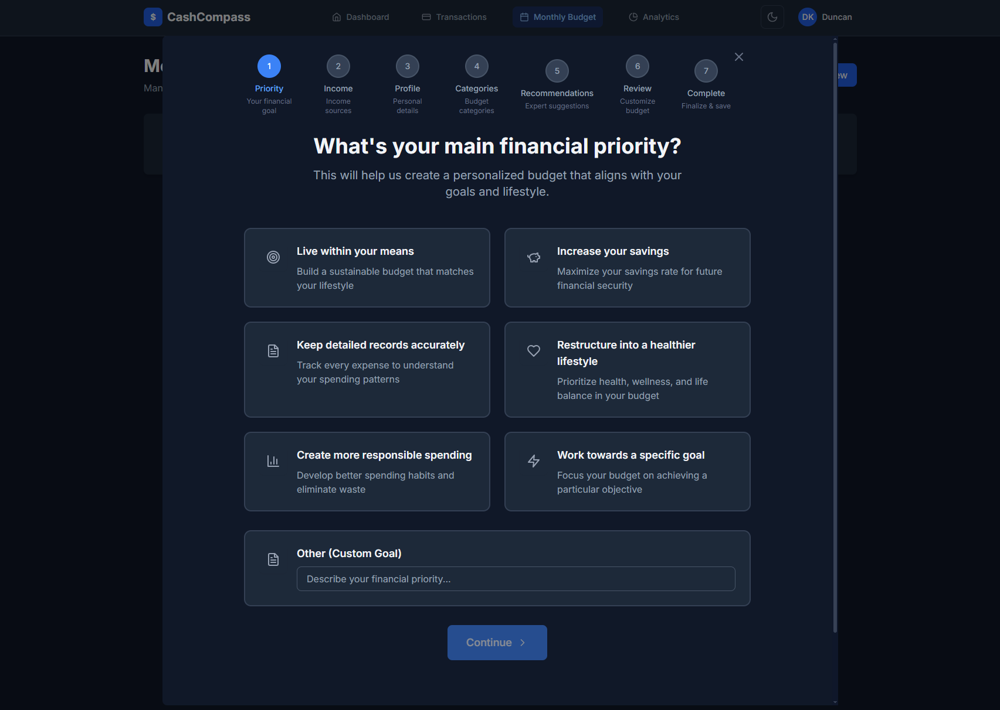
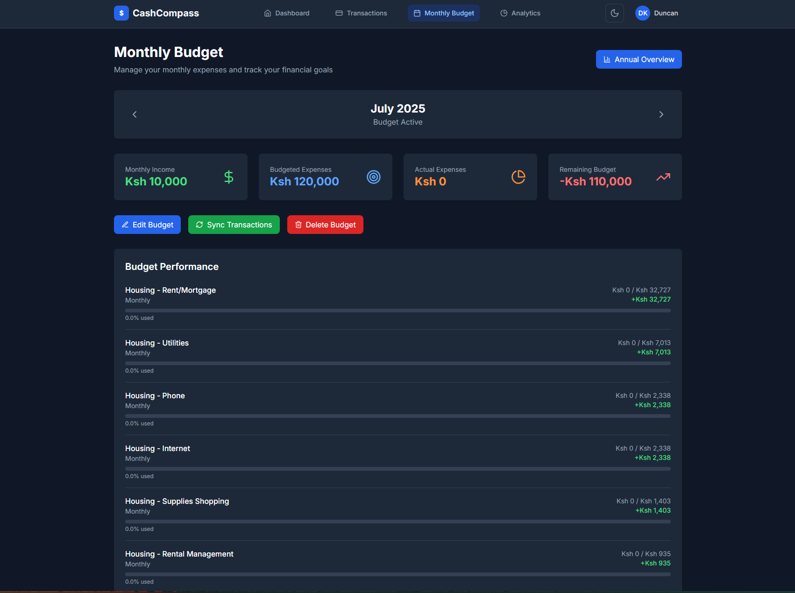
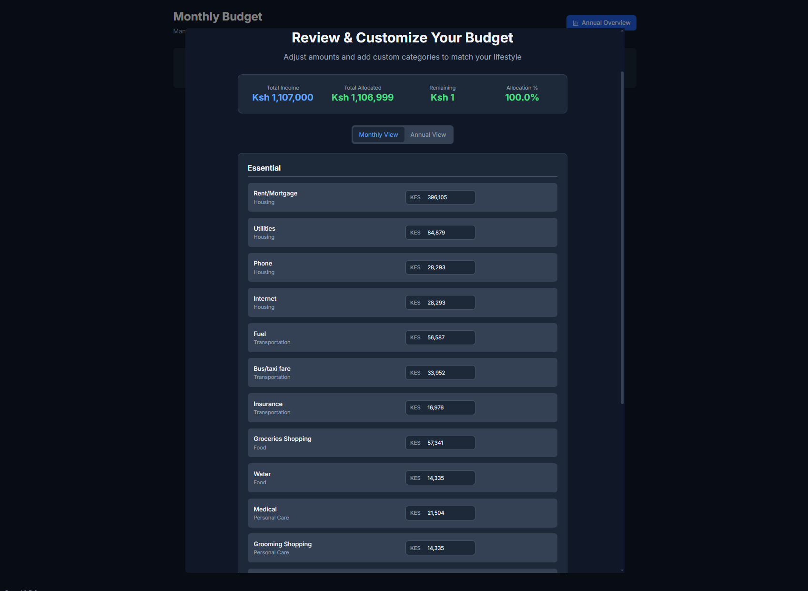
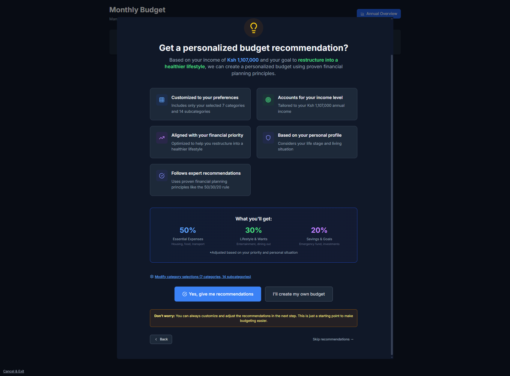
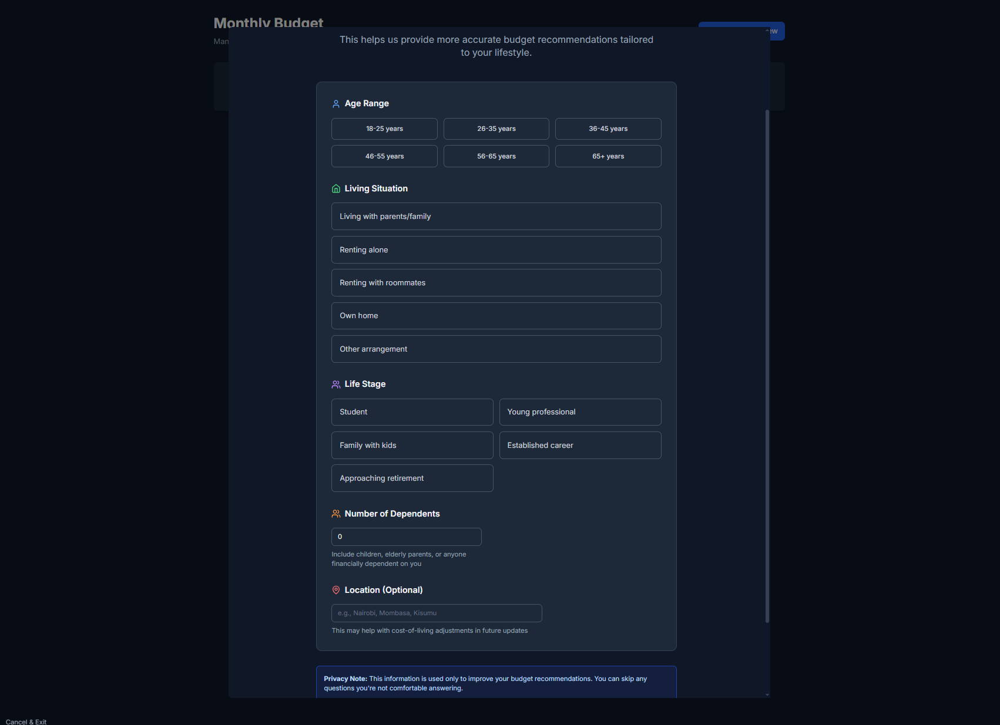

# 💰 CashCompass - Personal Finance Management System

A comprehensive MERN stack application for managing personal finances, budgeting, and financial analytics.

## 🚀 Live Application

**🌐 Frontend:** [https://cashcompass-frontend.vercel.app](https://cashcompass-frontend.vercel.app)  
**🛠️ Backend API:** [https://cashcompass-backend-jp53.onrender.com](https://cashcompass-backend-jp53.onrender.com)

## 📋 Project Description

CashCompass is a full-stack personal finance management application built with the MERN stack (MongoDB, Express.js, React.js, Node.js). It provides users with comprehensive tools to track expenses, manage budgets, analyze spending patterns, and gain insights into their financial health.

### ✨ Key Features

- **🔐 User Authentication** - Secure registration, login, and JWT-based authentication
- **💸 Transaction Management** - Add, edit, delete, and categorize financial transactions
- **📊 Budget Creation** - Create and track monthly/annual budgets with spending limits
- **📈 Financial Analytics** - Interactive charts and insights on spending patterns
- **🎯 Goal Setting** - Set and track financial goals and savings targets
- **📱 Responsive Design** - Works seamlessly on desktop, tablet, and mobile devices
- **🌙 Dark/Light Mode** - Toggle between dark and light themes
- **💾 Data Export** - Export transaction data for external analysis

## 🛠️ Tech Stack

### Frontend
- **React.js** - Component-based UI library
- **React Router** - Client-side routing
- **Tailwind CSS** - Utility-first CSS framework
- **Chart.js/Recharts** - Data visualization
- **Axios** - HTTP client for API requests
- **React Context API** - State management

### Backend
- **Node.js** - JavaScript runtime
- **Express.js** - Web application framework
- **MongoDB** - NoSQL database
- **Mongoose** - MongoDB object modeling
- **JWT** - JSON Web Tokens for authentication
- **bcryptjs** - Password hashing
- **Express Validator** - Input validation
- **Helmet** - Security middleware

### Deployment & DevOps
- **Frontend:** Vercel
- **Backend:** Render
- **Database:** MongoDB Atlas
- **Version Control:** Git & GitHub

## 📱 Screenshots

### Dashboard Overview

*Main dashboard showing budget overview and quick statistics*

### Transaction Management

*Transaction list with filtering and search capabilities*

### Budget Categories

*Budget creation and category management*

### Financial Analytics

*Interactive charts showing spending patterns and trends*

### Income Tracking

*Income tracking and management interface*

### Priority Settings

*Budget priority and goal setting features*

### Budget Review

*Comprehensive budget review and analysis*

### Custom Budget Creation

*Step-by-step custom budget creation wizard*

### Recommendations

*AI-powered financial recommendations and insights*

### User Profile

*User profile and account settings*

## 🚀 Getting Started

### Prerequisites

- Node.js (v18 or higher)
- MongoDB (local installation or Atlas account)
- npm or yarn package manager

### Installation

1. **Clone the repository**
   ```bash
   git clone https://github.com/KamungeD/CashCompass.git
   cd CashCompass
   ```

2. **Backend Setup**
   ```bash
   cd backend
   npm install
   
   # Create environment file
   cp .env.example .env
   # Add your MongoDB URI, JWT secret, and other configurations
   
   # Start the backend server
   npm run dev
   ```

3. **Frontend Setup**
   ```bash
   cd ../frontend
   npm install
   
   # Create environment file with API URL
   echo "VITE_API_URL=http://localhost:5005/api/v1" > .env
   
   # Start the frontend development server
   npm run dev
   ```

4. **Access the Application**
   - Frontend: `http://localhost:5173`
   - Backend API: `http://localhost:5005`

### Environment Variables

#### Backend (.env)
```env
NODE_ENV=development
PORT=5005
MONGO_URI=your_mongodb_connection_string
JWT_SECRET=your_jwt_secret_key
JWT_EXPIRE=30d
BCRYPT_SALT_ROUNDS=10
```

#### Frontend (.env)
```env
VITE_API_URL=http://localhost:5005/api/v1
VITE_APP_NAME=CashCompass
```

## 📚 Documentation

- **[API Documentation](docs/API.md)** - Complete API endpoints and usage
- **[Database Schema](docs/DATABASE_SCHEMA.md)** - Database structure and relationships
- **[System Architecture](docs/ARCHITECTURE.md)** - High-level system design

## 🧪 Testing

### Backend Tests
```bash
cd backend
npm test
```

### Frontend Tests
```bash
cd frontend
npm test
```

### End-to-End Tests
```bash
npm run test:e2e
```

## 📦 Deployment

### Backend (Render)
1. Connect your GitHub repository to Render
2. Set environment variables in Render dashboard
3. Deploy with build command: `npm install`
4. Start command: `npm start`

### Frontend (Vercel)
1. Connect your GitHub repository to Vercel
2. Set root directory to `frontend`
3. Set environment variables: `VITE_API_URL`
4. Deploy with build command: `npm run build`

## 🤝 Contributing

1. Fork the repository
2. Create a feature branch (`git checkout -b feature/AmazingFeature`)
3. Commit your changes (`git commit -m 'Add some AmazingFeature'`)
4. Push to the branch (`git push origin feature/AmazingFeature`)
5. Open a Pull Request

## 📄 License

This project is licensed under the MIT License - see the [LICENSE](LICENSE) file for details.

## 👨‍💻 Author

**Duncan Kamunge**
- GitHub: [@KamungeD](https://github.com/KamungeD)
- Email: duncan.kamunge@gmail.com

## 🙏 Acknowledgments

- Built as part of the MERN Stack Development Course
- Thanks to the open-source community for the amazing tools and libraries
- Special thanks to the instructors and mentors who guided this project

---

**⭐ If you found this project helpful, please give it a star on GitHub!**